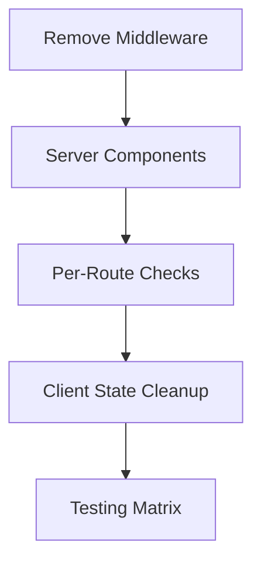

# Auth System Migration to Server-Side Protection

## Migration Context
**Problem Statement**: Remove middleware-based auth due to:
- Production redirect issues (localhost leaks)
- Client-side flickering of protected content
- Complex URL detection logic

**Solution Approach**: 
- Server-side route protection using Next.js 13+ App Router
- Per-route session validation
- Simplified auth state management (its for MVP)

### Core Objectives
1. 🚫 Remove all middleware dependencies
2. 🔐 Server-side session checks in page components
3. 🧩 Maintain client state for UI interactions
4. ⚡ Eliminate client-side redirect flickering

### Technical Context
- **Stack**: Next.js 14, Supabase Auth
- **Key Packages**: 
  - `@supabase/auth-helpers-nextjs`
  - `next/navigation` for redirects
- **Critical Files**:
  - `src/app/layout.tsx` (Root session handling)
  - `src/providers/auth-provider.tsx` (Client state)
  - All page components in protected routes

### Implementation Strategy

## Current Migration Progress

## Phase 1: Middleware Removal
1. Delete `middleware.ts` file
2. Remove protected/public route arrays from existing code
3. Clean up middleware-related redirect logic in:
   - `auth-provider.tsx`
   - `callback/route.ts`
   - `NavWrapper.tsx`

## Phase 2: Server-Side Route Protection
1. Protected Routes Setup (per-route):
   - `/dashboard/**`
   - `/profile/**`
   - `/settings/**`
   
   Each route needs:
   - Server component check
   - Session validation
   - Redirect to login if unauthenticated

2. Public Routes Setup:
   - `/login`
   - `/signup`
   - `/` (landing)
   
   Each needs:
   - Server check for existing session
   - Redirect to dashboard if authenticated

## Phase 3: Client Component Updates
1. NavWrapper Visibility:
   - Convert to server component
   - Use cookies for auth state
   - Simplify hide/show logic

2. Auth Provider Changes:
   - Remove all redirect logic
   - Keep user state management
   - Add server session sync via props

3. Landing Page:
   - Add server-side guest check
   - Remove client-side redirect fallback

## Phase 4: Environment Cleanup
1. Remove obsolete:
   - `getBaseUrl` helper
   - Middleware-related env vars
   - URL detection logic in auth flows

2. Update NextConfig:
   - Remove Vercel URL redirect rules
   - Simplify production URL handling

## Phase 5: Testing Plan
1. Route-by-route validation:
   - Direct URL access tests
   - Logged-in/out state checks

2. User Flow Tests:
   - Login → Dashboard
   - Logout → Login
   - Session persistence

3. Edge Cases:
   - Expired sessions
   - Manual URL entry
   - Cross-tab auth changes
