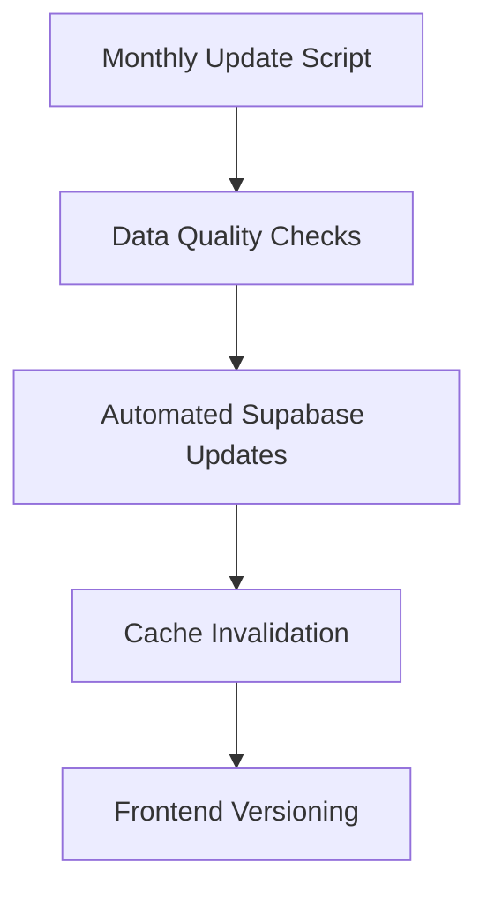

## 1. Feature Overview

The Safety Metrics feature provides users with essential safety assessments for the airbnb location report page within LA (with more cities planned for future releases). It transforms official police data into intuitive safety indicators that address common user concerns.

## 2. Problem Statement

Users need easily interpretable safety information when evaluating neighborhoods. This feature translates complex police data into practical insights focused on five key safety dimensions that matter most to users.

## 3. User Value Proposition

- **Primary Value**: Enables informed decisions about neighborhoods based on actual crime data
- **Target Users**: Residents considering relocation, visitors, parents, women, and safety-conscious individuals
- **Differentiation**: Translates complex crime statistics into question-based metrics users can immediately understand

## 4. Detailed Requirements

### 4.1 Safety Metric Types

Each district will be evaluated across five key safety dimensions:

| Metric Type | User Question | Description |
| --- | --- | --- |
| Night Safety | "Can I go outside after dark?" | Safety for pedestrians during evening/night hours |
| Vehicle Safety | "Can I park here safely?" | Risk of vehicle theft and break-ins |
| Child Safety | "Are kids safe here?" | Overall safety concerning crimes that could affect children |
| Transit Safety | "Is it safe to use public transport?" | Safety at and around transit locations |
| Women's Safety | "Would I be harassed here?" | Assessment of crimes that disproportionately affect women |

### 4.2 Metric Content Structure

For each safety metric, the platform will provide:

1. **Score**: Simple rating (1-10) with color coding
2. **Title**: The user question (e.g., "Can I go outside after dark?")
3. **Description**: Brief explanation of current safety status

### 4.3 Initial City Support

- Los Angeles - https://data.lacity.org/resource/2nrs-mtv8.json
   
## 5. Data Analysis Approach

### 5.1 Data Sources

**MVP Data Sources:**

- LA: Los Angeles Police Department API

### 5.2 Data Analysis Techniques

1. For data analysis we will use python. 
2. **Crime Type Mapping**:
    - Create a standardized mapping of police codes to our five safety metrics
    - Example: Assign crimes like robbery, assault after 6pm to "Night Safety" category
    - Document each mapping decision for transparency
3. **Geographic Normalization**:
    - Normalize crime counts by district population and area
    - Calculate incidents per 1,000 residents for fair comparison across districts
4. **Temporal Analysis**:
    - Focus on last 12 months of data with higher weighting for recent months
5. **Safety Score Calculation**:
    - Convert normalized crime rates to 1-10 scale using percentile ranking within each city
    - Apply logarithmic scaling to prevent extreme outliers from skewing results
    - Calculate separate scores for each of the five safety dimensions
6. **Data Update Cycle**:
    - Monthly refresh of all metrics
    - Clear timestamp of when data was last updated

### 5.3 Police Data Guide Requirements

For each supported city:

- Data dictionary of relevant police codes
- Brief explanation of how police categorize crimes in that jurisdiction

## 6. User Experience (Simplified MVP)

### 6.1 Metric Display

- List all five metrics for each district with scores
- Allow expand/collapse for additional details

## 8. Implementation Plan

### 8.1 Phase 1 (Initial MVP)

| Component       | Implementation Steps                              | Timeline |
|-----------------|---------------------------------------------------|----------|
| Data Pipeline   | Python script for LAPD data → Supabase            | 3 days   |
| Backend         | Supabase table setup & indexing                   | 1 day    |
| Frontend        | SafetyMetrics component with score visualization  | 2 days   |
| Integration     | Add to report page navigation & layout            | 1 day    |

### 8.2 Next Steps (Post-MVP)



## 9. Risk Assessment & Mitigation

| Risk | Mitigation |
| --- | --- |
| Different crime categorization between cities | Create standardized mapping framework with city-specific adjustments |
| Data gaps or inconsistencies | Clearly indicate data limitations, implement data quality checks |
| Neighborhood stigmatization | Focus on practical safety information rather than comparative judgments |
| Misinterpretation of metrics | Provide clear context and explanation for each metric |

## 10. Technical Implementation Considerations

### 10.1 Safety Metrics Implementation

**Data Pipeline Architecture:**
```python
# Simplified data flow:
1. LAPD API → Raw JSON
2. Python processing script:
   - Crime type mapping
   - Geographic normalization
   - Score calculation
3. Output: CSV/JSON → Supabase
```

**Frontend Components:**
```typescript
// SafetyMetrics React Component Props
type SafetyMetric = {
  type: 'night' | 'vehicle' | 'child' | 'transit' | 'women';
  score: number;
  question: string;
  description: string;
};

// Supabase Query Example
const { data } = await supabase
  .from('safety_metrics')
  .select('*')
  .eq('location_id', geohash);
```

**Supabase Schema:**
```sql
-- Simplified table structure
CREATE TABLE safety_metrics (
  location_id TEXT,  -- Geohash prefix
  metric_type TEXT,  -- Our 5 categories
  score INT,         -- 1-10 scale
  description TEXT   -- Dynamic explanation
);
```
---
